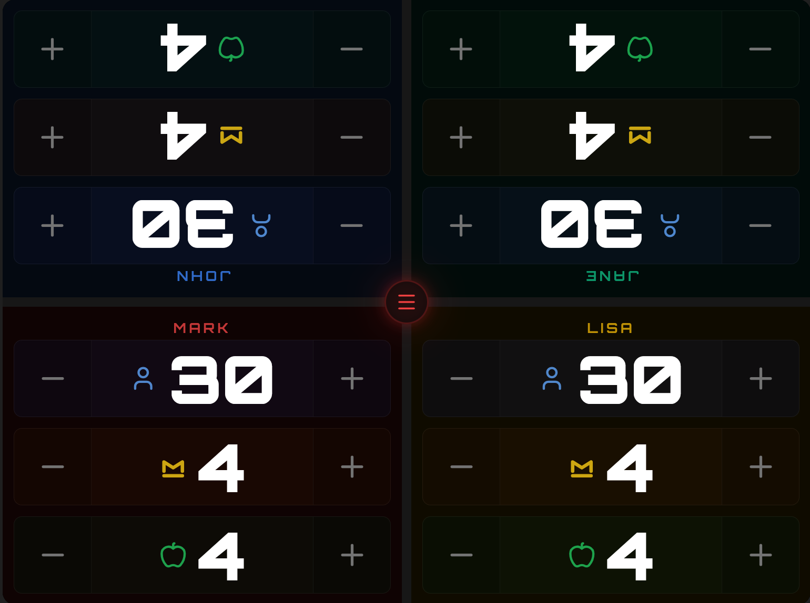
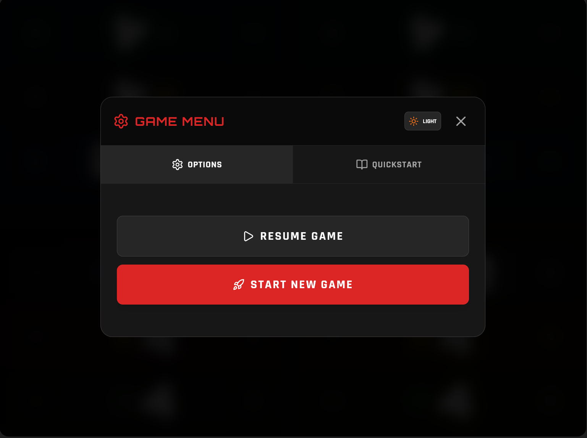
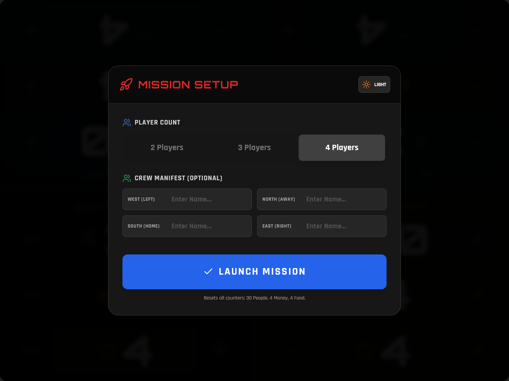
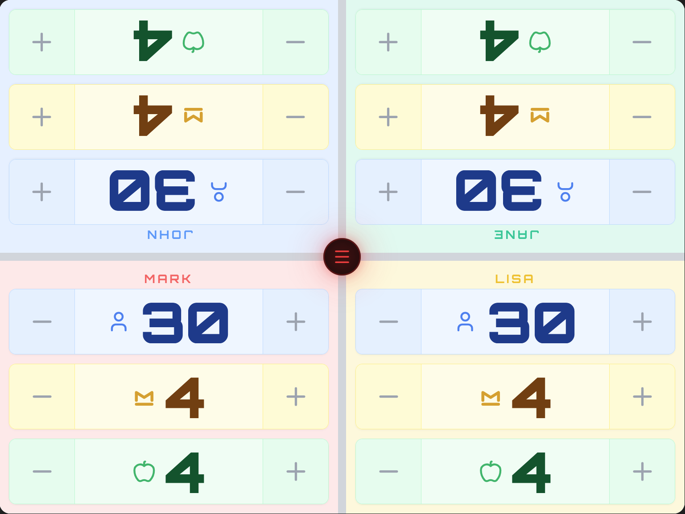

# Moon Colony Bloodbath Tracker

A responsive, touch-friendly resource companion app designed for the board game **Moon Colony Bloodbath**. Built with React and Tailwind CSS, this application replaces physical tokens with a streamlined digital dashboard, perfect for a tablet placed in the center of the playing area.

## Screenshots


*The main 4-player interface in Dark Mode*


*In-game menu with Quickstart rules and Options*


*Mission Setup Modal for configuring players*


*High-contrast Light Mode for bright environments*

## Features

*   **Table-Optimized UI:** A 4-quadrant split-screen layout designed to be accessible from all sides of the table.
*   **Head-to-Head Orientation:** Top sectors are rotated 180° for players sitting across the table, while bottom sectors face the near side.
*   **Resource Management:** Tracks **People**, **Money**, and **Food** with massive, easy-to-hit touch targets designed for quick interaction.
*   **Player Configuration:** Supports 2, 3, or 4 player setups. Unused sectors are visually disabled/grayed out.
*   **Visual Themes:** Switch seamlessly between a gritty **Sci-Fi Dark Mode** and a clean **High-Contrast Light Mode**.
*   **Digital Rules Reference:** Includes a built-in Quickstart guide tab for easy rule lookups during play.

## Tech Stack

*   React 19
*   Tailwind CSS
*   Lucide React Icons

## Usage

Open the app on a tablet or large phone, place it in the middle of your game table, select the number of players, and start the bloodbath!

## Deployment

Since this app uses ES Modules directly in the browser (via the `importmap`), it does not require a complex build step or Node.js server. It can be hosted on any static web server.

### Option 1: GitHub Pages (Easiest)
1.  Upload all files to a GitHub repository.
2.  Go to **Settings** -> **Pages**.
3.  Select the **main** branch as source.
4.  Your app will be live at `https://<username>.github.io/<repo>/`.

### Option 2: Vercel / Netlify
1.  Connect your repository.
2.  Set **Output Directory** to the root folder (default).
3.  Deploy.

### Option 3: Local Use
You cannot open `index.html` directly from the file system due to CORS rules. You must use a local server:
```bash
python3 -m http.server
```
Then open `http://localhost:8000`.